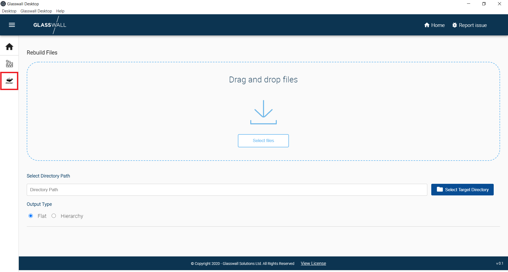
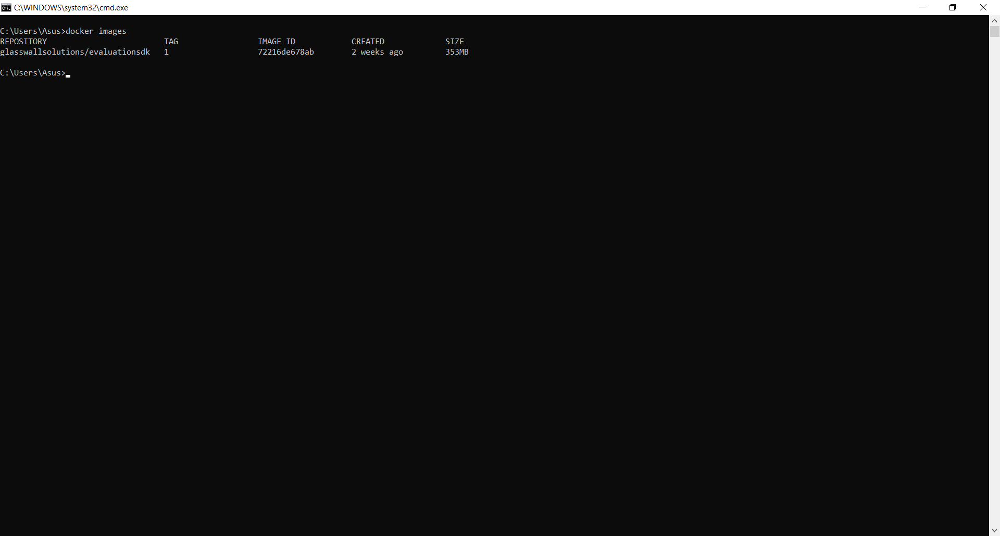
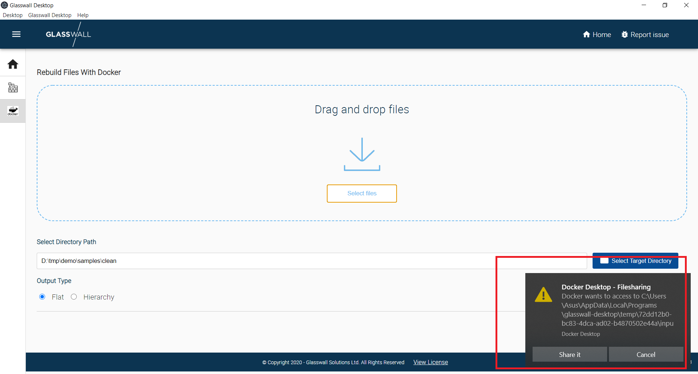
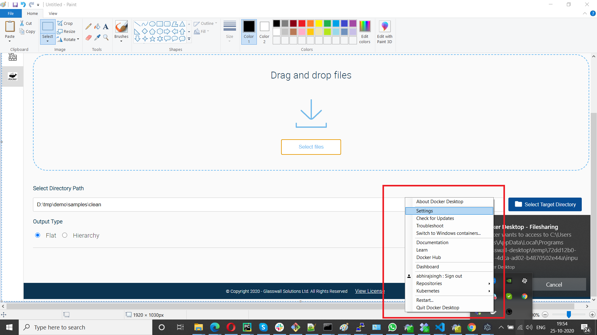
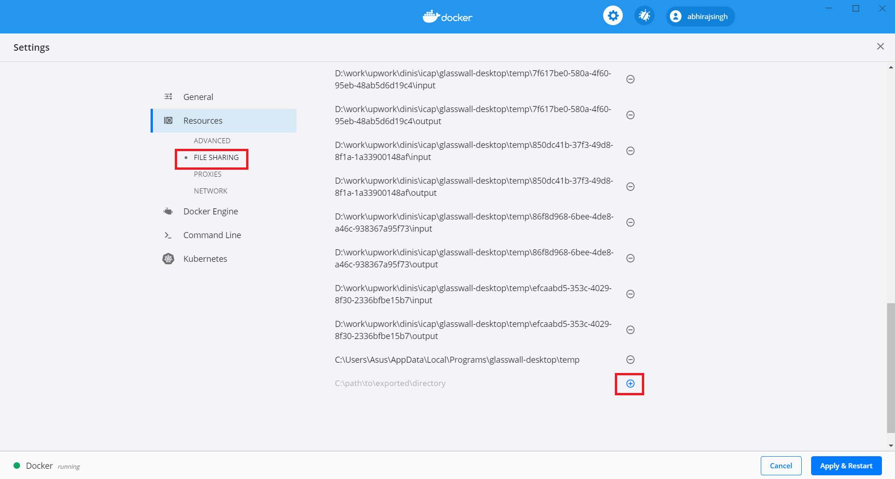
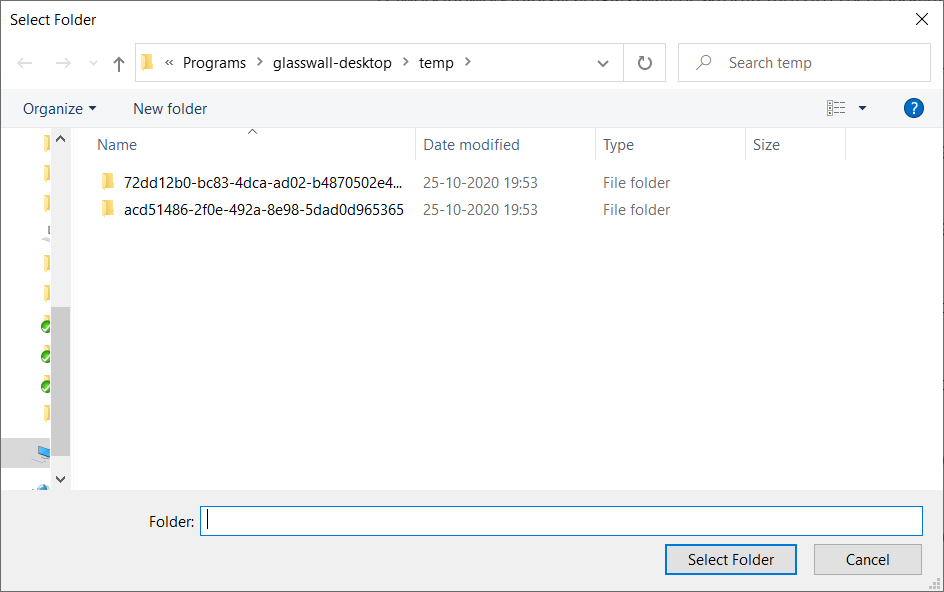

# Glasswall Desktop

Glasswall Desktop is a desktop application that provides multi file drag and drop rebuild workflow.

## Membership

| Avatar | Name | Role | Time Zone |
| -------------------------------------------|----------------------|----------------------------| -------- |
|   | Sudhidh Kumar [@kumarsudhish](https://github.com/kumarsudhish) |  Delivery Manager/QA | IST |
|   | Sanchit Garg [@rajmbcoderx](https://github.com/rajmbcoderx) | Member | IST |
|   | Mudit Gupta [@gmuditdce](https://github.com/gmuditdce) | Member | IST |
|   | Nishant Swarup [@nishantswarup](https://github.com/nishantswarup) | Member | IST |

## Current Objective and Key Results
**Objective:**
1. Just drag and drop the files from your local hard disk, and the Glasswall Desktop will rebuild them using the Glasswall Rebuild API (currently hosted on Azure).
2. To support different directory structures, give freedom to save the files at custom directory structure or at default location by maintaining the same directory as that of the parent folder.
3. To support different platforms (Windows, MAC and Linux)
4. To provide online and offline file-rebuild support. The online version to use glasswall-rebuild cloud hosting of rebuild engine to rebuild files. The offline version to use glasswall docker image to provide the ame functions offline.
5. So for running the offline mode user has to install the docker on the respective OS (Windows/MAC/Ubuntu) https://docs.docker.com/engine/install/

# [Glasswall Desktop](https://k8-proxy.github.io/glasswall-desktop/)

**Key Results:**
1. Build with <a href="https://github.com/electron/electron"> Electron</a> , react, it is aimed at providing multi file drag and drop rebuild workflow.
2. It is a standalone application for MacOS, Windows and Linux operating systems.

## Build Setup
**Setup:**
* Clone the repo to your local directory
* Navigate to the directory where package.json is placed
* Run `npm install`. This will install required packages for this project which has been mentioned in the package.json

**Run:**
* To build the source code `npm run build`. Build is requried to compile typescript 
* To start the application locally `npm run start`

**Distribution Package:**
* To create distribution packages `npm run dist`. This will create the build binaries/exe to Mac, Windows, Linux platforms in the dist folder.

## Important links

* If you are working on this project via Upwork, see also our [Upwork Rules of Engagement](https://github.com/filetrust/Open-Source/blob/master/upwork/rules-of-engagement.md)
* If you are newcomer, then please check [Glasswall newcomers checklist ](https://github.com/filetrust/Open-Source )

## Installing

Warning: This software is under active development. Use at your own risk.

### macOS

Download the latest [glasswall-desktop release](https://github.com/k8-proxy/glasswall-desktop/releases/download/v1.0.6/glasswall-desktop-1.0.6.dmg).

Mac users will need to follow the below steps on the app when you first launch it, until we have [code signing](https://www.electron.build/code-signing) set up

* **Step 1**

* **Step 2**

* **Step 3**

TBD: Will automatically update when a new release is available.

### Windows

Download the latest [glasswall-desktop release](https://github.com/k8-proxy/glasswall-desktop/releases/download/v1.0.6/glasswall-desktop-Setup-1.0.6.exe)

Windows users will need to follow the below steps to install and launch the application.

* **Step 1**
Download the package from the above link, observe that .exe executable would be downloaded, glasswall-desktop-Setup-1.0.6.exe.

* **Step 2**
Once executable has been downloaded, double click on the .exe and observe that installation starts.

* **Step 3**
Observe that once the installation is complete, app is launched successfully showcasing the Welcome page

* **Step 4**
Click on Get Started to navigate to the Rebuild Files page.

* **Step 5**

**Rebuild offline with glasswall docker**

* Prerequisite - Ensure docker is installed on the machine running the rebuild with docker.
Platform specific installation guides are avalaible at https://docs.docker.com/engine/install/

* Click on the "Docker" icon in the sidebar menu.

* Choose the files to rebuild and the target directory.

* For first time installations, the application will pull the glasswallsolutions/evaluationsdk:1 docker image from docker-hub registry.

* For first time rebuild, the application will ask for user permission to share file systems with docker

Allow by clicking "Share It".

* To avoid this notification in future, note the "temp" directory that the application asks to allow access to. Follow below steps to add this directory permanently in docker file sharing settings to avoid these notifications in the future

* Open "Docker-Settings" from systemtray

* Open "File-Sharing" tab and click on the "+" icon

* Add the diectory noted above, for which the notification appears

Once added, further rebuilds will not prompt to allow sharing the directory each time when using docker to rebuild files.

### Linux App Image

Glasswall desktop is only available for 64-bit Linux systems.
Download the latest [glasswall-desktop release](https://github.com/k8-proxy/glasswall-desktop/releases/download/v1.0.6/glasswall-desktop-1.0.6.AppImage)

Linux/Ubuntu users will need to follow the below steps on the app when you first launch it.

* **Step 1**
Make the downloaded package as an executable by running below command.

**Command :** chmod a+x glasswall-desktop-1.0.6.AppImage

* **Step 2**
Run below command to launch the desktop application

**Command :** ./glasswall-desktop-1.0.6.AppImage

### Installing from source

1. Clone the repo
2. Open the command prompt (On windows) and terminal on (Ubuntu/Linux/MAC)
3. Run `npm  install`
4. `npm run build`
5. `npm run start`

## Building

### IDE 
To configure the codebase clone or download the codebase from the git and install the [Visual Studio Code](https://code.visualstudio.com/)

### Importing Project in Visual Studio Code
1. Click on File in the Visul Studio tool bar.
2. Select Open Folder option.
3. Select the cloned glasswall-desktop folder.
4. Observe that Project has been imported.

## Release with git actions

To release the linux version following steps are required

1. Create Ubuntu One account on https://login.ubuntu.com/
2. After creating Ubuntu One account login to https://snapcraft.io/ using account created in step 1
3. Follow the instruction to register your app https://snapcraft.io/docs/registering-your-app-name app name will be "glasswall-desktop"
4. After app name registration export the login credential using "snapcraft export-login --snaps SNAP_NAME --channels edge -" command.
5. Copy the output of the command and add it as a github secret with name "snapcraft_token". Link on how to add secrets in github account https://docs.github.com/en/free-pro-team@latest/actions/reference/encrypted-secrets#creating-encrypted-secrets-for-a-repository

## Debugging
Please change DEBUG variable to true and restart the app to start the electron debugger for code debugging purposes.

## Open Issues Highlishts
* Rebuild App: Signed build needs to be created for rebuild desktop app.
* On selecting Hierarchy radio button, and uploading folder in single Hierarchy files are not getting saved in same Hierarchy format in target folder.
* Upgrade installer not working on MAC OS
* For Complete list of open issue can be found here <a href="https://github.com/k8-proxy/glasswall-desktop/issues#workspaces/glasswall-desktop-5f8d313208783c0012d1b601/board?labels=bug&repos=304378562"> Glasswall Desktop App Open Issues</a>

## Contributing
Bug reports are welcome on GitHub at https://github.com/k8-proxy/glasswall-desktop

## Code Coverage

## Troubleshooting
* MAC Application: Incase of cloud rebuild failure, follow below steps:
* Delete the **config** folder under this path /Users/<system-user>/Library/Application\Support/glasswall-desktop
* On command prompt run this command **rm -rf config* ** to delete all the content in above path
* Incase docker is not installed and user installs the docker, while desktop app is in running state, user is requested to relaunch the desktop app.
* To run on Linux systems as non-root user, make sure to follow this link to allow the user to access docker - https://docs.docker.com/engine/install/linux-postinstall/
